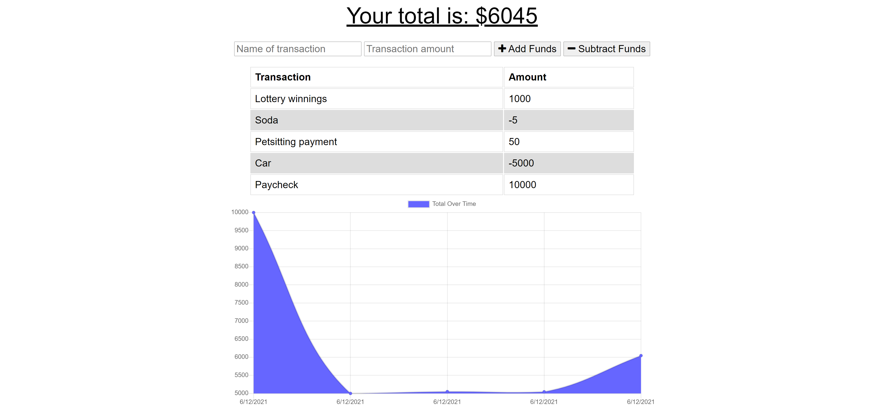

# Unit-18-PWA-Homework
# Online/Offline Budget Trackers

This application allows users to manage their budget by entering deposits and expenses. The application can be used both online and offline.

The deployed application can be found [here](https://esd-budget-18.herokuapp.com/). The application's GitHub repository can be found [here](https://github.com/elisesamanthadaly/Unit-18-PWA-Homework).

## Usage

Enter the name of a transaction in the corresponding field, as well as that transaction's dollar amount. Clicking "+ Add Funds" adds the transaction as a deposit, clicking "- Subtract Funds" adds the transaction as an expense. The application can be used both online and offline.

## Credits

Application front-end provided by UNC Coding Bootcamp as starter code.

## License

MIT License

Copyright (c) 2021 Elise Daly

Permission is hereby granted, free of charge, to any person obtaining a copy
of this software and associated documentation files (the "Software"), to deal
in the Software without restriction, including without limitation the rights
to use, copy, modify, merge, publish, distribute, sublicense, and/or sell
copies of the Software, and to permit persons to whom the Software is
furnished to do so, subject to the following conditions:

The above copyright notice and this permission notice shall be included in all
copies or substantial portions of the Software.

THE SOFTWARE IS PROVIDED "AS IS", WITHOUT WARRANTY OF ANY KIND, EXPRESS OR
IMPLIED, INCLUDING BUT NOT LIMITED TO THE WARRANTIES OF MERCHANTABILITY,
FITNESS FOR A PARTICULAR PURPOSE AND NONINFRINGEMENT. IN NO EVENT SHALL THE
AUTHORS OR COPYRIGHT HOLDERS BE LIABLE FOR ANY CLAIM, DAMAGES OR OTHER
LIABILITY, WHETHER IN AN ACTION OF CONTRACT, TORT OR OTHERWISE, ARISING FROM,
OUT OF OR IN CONNECTION WITH THE SOFTWARE OR THE USE OR OTHER DEALINGS IN THE
SOFTWARE.